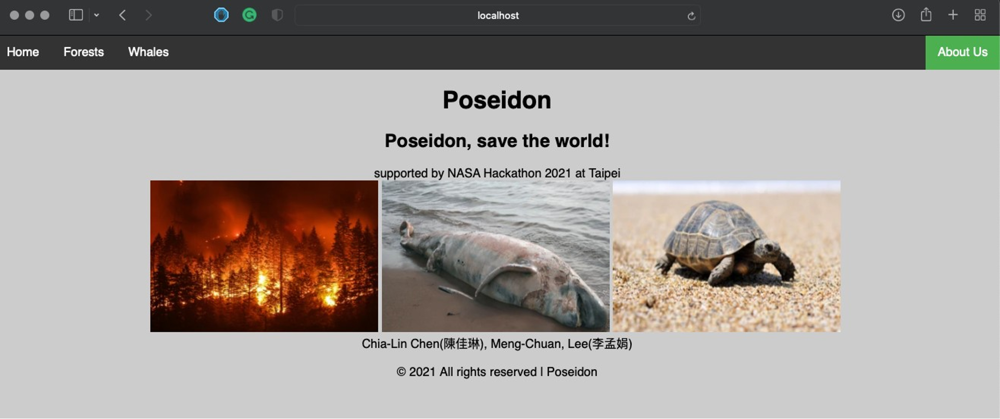
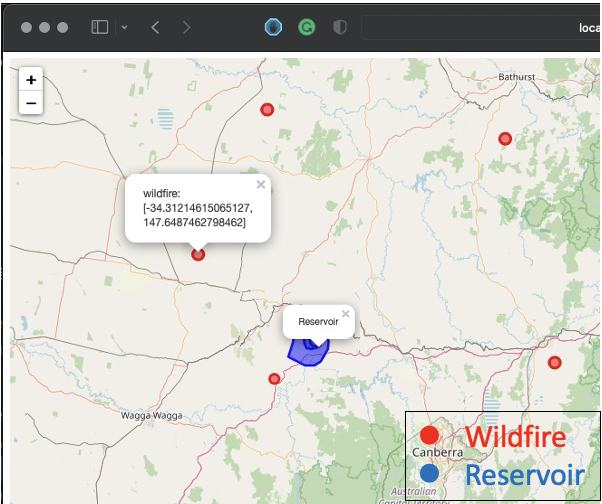
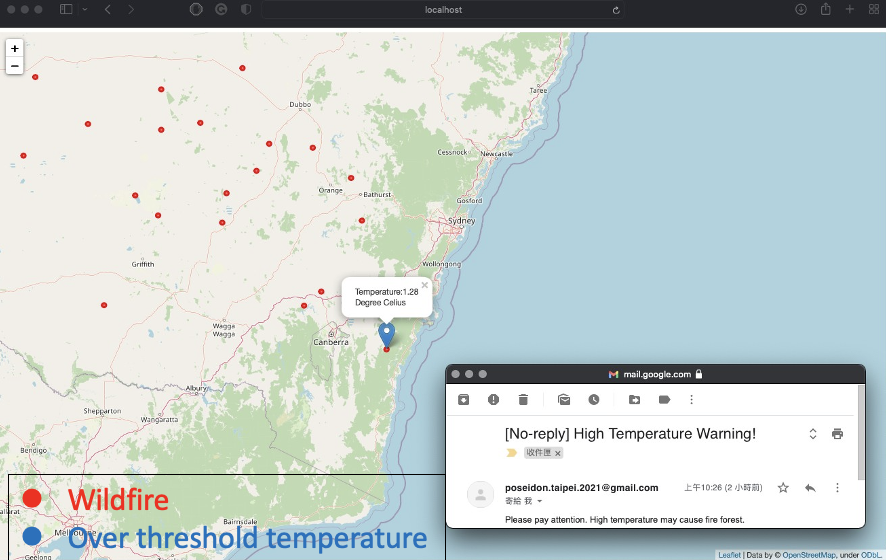
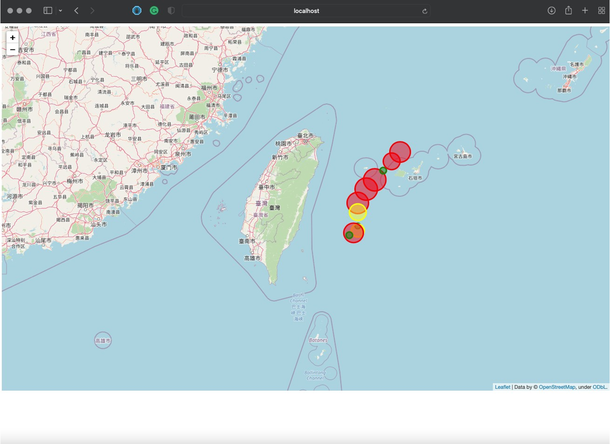

# 2021 NASA Hackathon

CHALENGES: No.24 WARMING: THINGS ARE HEATING UP!

Author: Chia-Lin,Chen(陳佳琳), Meng-Chuan, Lee(李孟娟)

30secs video is here: https://www.youtube.com/watch?v=SaAA0qIJpa0

2mins video is here: https://www.youtube.com/watch?v=BAonsE3p2JE

## Description:

The motivation is saving sea turtles, whose extinct are dominated by temperature. 
Sea turtles' sexulity are affected by temperature. For example, over 31 degrees celsius, almost all turtles will become female.
People know that global warming will let temperature up, to slow down global warming, we can reduce carbon elimination.
To reduce it, we have two ideas, saving whales and forests.
Through protected whales and forests, it can reduce almost 200M tons of carbon.

Poseidon can notice fire forests before they burned, and find  best locations for reservoirs.
(Reservoirs can not only extinguishing but also keep place wet)
Poseidon can point out the routes of whales swimming, to avoid accidental injury by ships.

## Install:

pip install -r requirements.txt #install essentials

## Poseidon tool:

### Poseidon default opened on localhost:5000 (or 127.0.0.1:5000 or your_ip:5000)

1. localhos:5000

2. localhost:5000/result_Reservoirs

3. localhost:5000/FireForests

4. localhost:5000/Whales

* #### Develop Environment: MacBook Pro 2019(13''), Mac OS 11.6
* #### Coding Language: Python(3.6.10), HTML, CSS

Folders:

	root
	
	|-PoseidonAPI

	|-requirements.txt #help install

	|-Main.py #including features: homepage, forests(reservoir and high temperature warning mail, and whales routes.

	|-template

		|-homepage.html

		|-base.html

		|-xxx.html #all extends by base.html

		|-result_xxx.html # display folium maps

	|-static

		|-css #style

		|-fig #picture

	|-PoseidonWebCrawler

		|-CrawlerNASAtemparature.py #crawl NASA temperature data.

		|-crawlTransfer2dataset.py #Transfer original NASA temparature data to new ones.
		
		|-chromedriver # Selenium chrome driver
    
		|-dataset
+ REFERENCES

[Slide Source]

[Carbon]
- [NASA temperature & carbon]https://climate.nasa.gov/vital-signs/carbon-dioxide/
- [Wildfires]https://www.futuredirections.org.au/publication/wildfires-greenhouse-gas-emissions-and-climate-change/
- [straw]環保署-台灣產品碳足跡資訊網
- [disposable chopsticks ]中華商務-綠色快訊 2010 年 4 月 
- [plastic bags]台達電子文教基金會-低碳生活部落主編

[Dataset]
- [NASA Temperature] https://climate.nasa.gov/vital-signs/global-temperature/
- [Sea turtles: sexuality and temperature]
- [animal-friendly] https://animal-friendly.co/2019/11/01/seaturtles/
- [Nature] https://www.nature.com/articles/s41598-020-61984-2
- [NOAA] https://oceanservice.noaa.gov/facts/temperature-dependent.html
